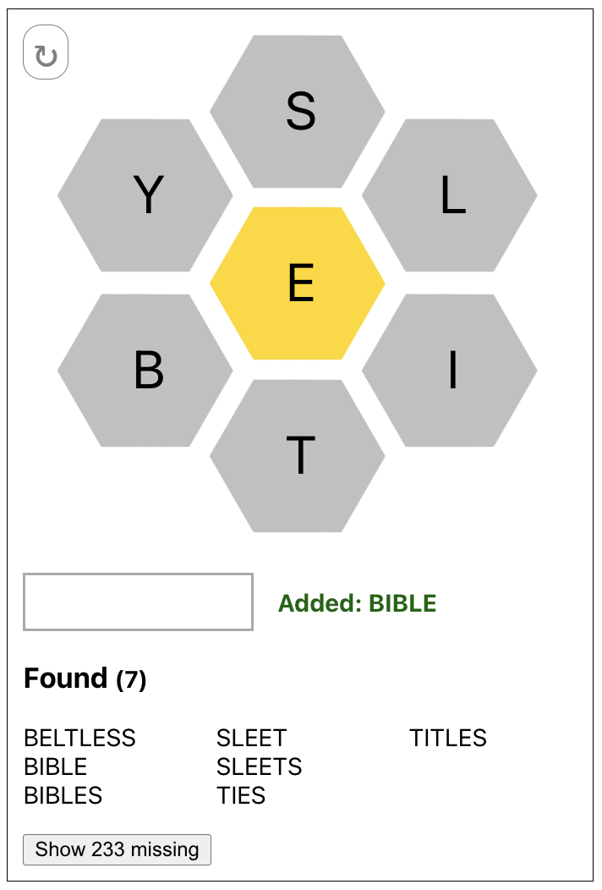
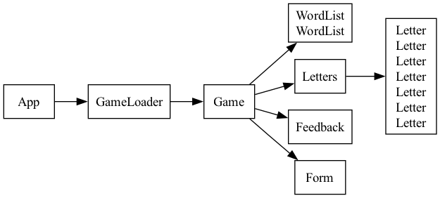

FreeBee React App
=================

Spelling Bee-like game implemented in React.

Starting
--------

To use::

  python3 server.py   # start API server

And then launch front-end in a separate terminal::

  npm install
  npm start

Design
------

